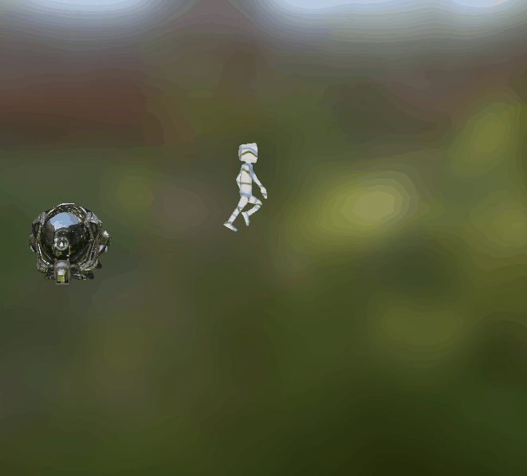
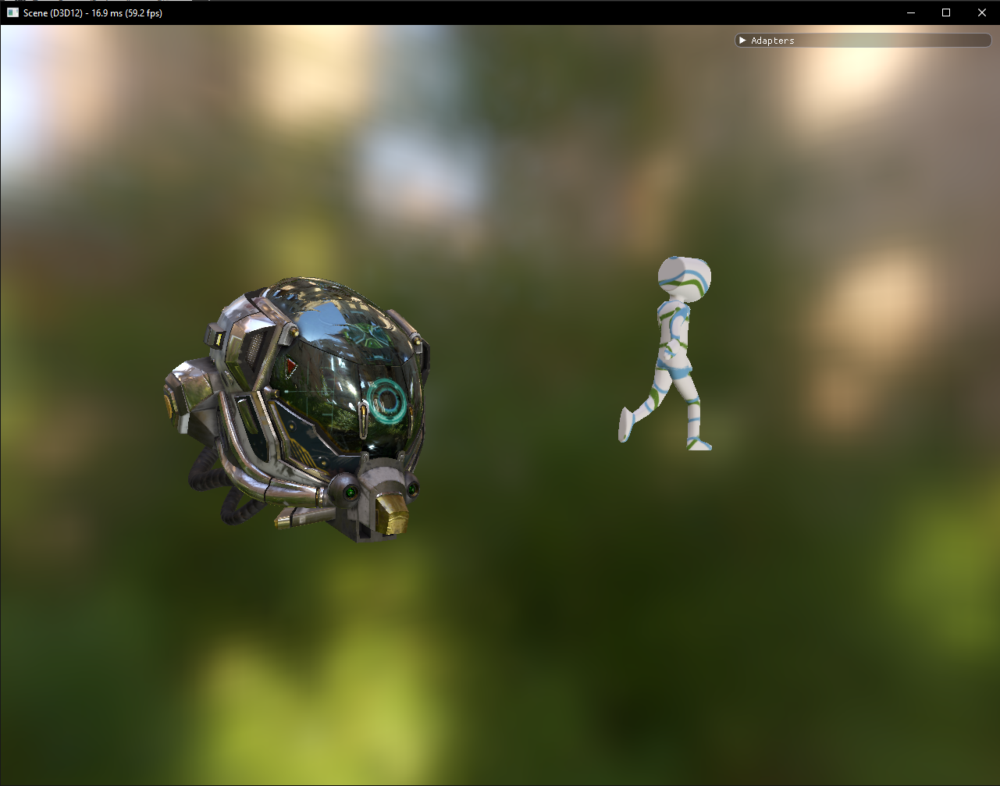

# Importation d'un GLTF Viewer

* Ajout d'une map d'environnement
* Ajout d'une caméra libre

# Result

Result with the camera in front of the actors :

Result with a different camera view point :

